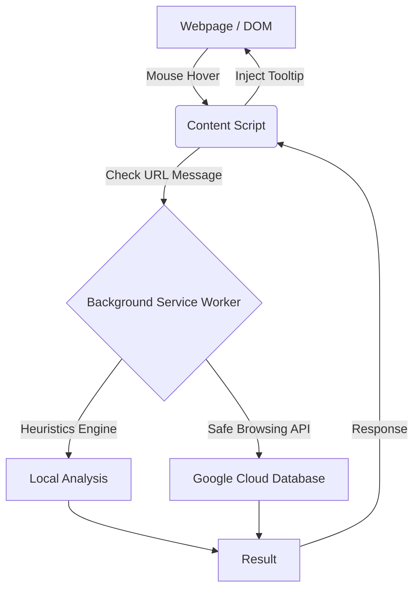

# PhishGuard - Technical Documentation & Verification Guide

## 1. Executive Summary
PhishGuard is an enterprise-grade Google Chrome Extension designed to provide real-time protection against phishing attacks, zero-day threats, and deceptive URLs. Leveraging the modern Manifest V3 architecture, PhishGuard ensures robust security with zero impact on browser latency.

## 2. System Architecture & Schema

The extension is composed of three primary operational layers:

1.  **Background Service Worker (`background.js`)**: The core engine of the extension. It manages state, communicates with external APIs, and enforces network rules.
2.  **Content Scripts (`content.js`)**: The DOM manipulation layer. It is injected into every webpage the user visits to monitor interactions and scan the page structure.
3.  **Options Dashboard (`options.html` / `options.js`)**: The user interface layer for configuration, monitoring, and educational training.

### Data Flow Schema

## 3. Core Mechanisms & Features

### 3.1 Declarative Net Request (DNR) Engine
*   **How it works**: Instead of intercepting every network request in JavaScript (which causes latency), PhishGuard pre-compiles a list of known malicious domains into DNR `block` rules. These rules are passed directly to the Chrome network layer, which blocks the requests at the browser level natively.
*   **Whitelist Bypass**: If a user adds a domain to their safe whitelist, the background script dynamically injects a DNR `allow` rule with a higher priority (Priority 2), which overrides the block rule (Priority 1).

### 3.2 Heuristics Engine (Zero-Day Protection)
*   **How it works**: Malicious actors constantly generate new URLs that are not yet on any blocklist. The heuristic engine analyzes URLs mathematically:
    *   **IP Masking**: Flags URLs that use raw IP addresses (e.g., `http://192.168.1.1`) instead of registered domains.
    *   **Typosquatting**: Flags URLs containing excessive hyphens (e.g., `paypal-secure-login-update-now.com`).

### 3.3 Context-Aware Content Scanning
*   **How it works**: The content script scans the DOM of the active page upon load. If it detects an `<input type="password">` field but the page is served over an unsecured `http://` connection, it immediately injects a fixed red warning banner at the top of the viewport.

### 3.4 Pre-Click Link Scanning
*   **How it works**: The content script listens for `mouseover` events on all `<a>` tags. It sends the `href` attribute asynchronously to the background script. If flagged by heuristics or Google Safe Browsing, a floating UI tooltip is injected next to the user's cursor *before* they click.

## 4. Verification & Testing Guide

This section outlines exactly how to verify and test every tool and feature in the extension.

### Test 1: Verifying Pre-Click Hover Scanning
**Purpose**: Ensure the extension intercepts suspicious links before the user clicks them.
**Steps**:
1. Open the local `test-phishing.html` file in your browser.
2. Scroll to the "Test Hover Protection" section.
3. Hover your mouse over the **"Track Package (IP Address Link)"**.
4. **Expected Result**: A red tooltip reading `⚠️ Suspicious Link: 192.168.1.100` will instantly appear next to your cursor.

### Test 2: Verifying Context-Aware Content Scanning
**Purpose**: Ensure the extension detects dangerous login forms on unsecured HTTP pages.
**Steps**:
1. Open the local `test-phishing.html` file in your browser (since local files are treated similarly to non-HTTPS environments by the extension).
2. Look at the top of the screen.
3. **Expected Result**: A massive red banner reading `🚨 WARNING: Unsecured Password Field Detected!` is injected into the top of the page.

### Test 3: Verifying the Google Safe Browsing API Integration
**Purpose**: Ensure the extension correctly communicates with Google's cloud servers.
**Steps**:
1. Obtain an API Key from the Google Cloud Console.
2. Open the PhishGuard **Dashboard & Settings**.
3. Paste the API key into the input field and click **Save**.
4. In your browser, navigate to the official Google Testing URL: `http://testsafebrowsing.appspot.com/s/phishing.html`
5. **Expected Result**: Chrome will trigger a native OS notification titled `PhishGuard Alert!` stating that access to a known threat was blocked.

### Test 4: Verifying the DNR Whitelist Engine
**Purpose**: Ensure user configurations successfully override the security engine.
**Steps**:
1. Go to the **Safe Whitelist** tab in the Dashboard.
2. Type `testsafebrowsing.appspot.com` into the input and click **Add Domain**.
3. Attempt to visit `http://testsafebrowsing.appspot.com/s/phishing.html` again.
4. **Expected Result**: The extension will completely ignore the site. No notification will appear, proving the DNR `allow` rule successfully overrode the block rules and the API checks.

---
*Generated by Antigravity for PhishGuard*
